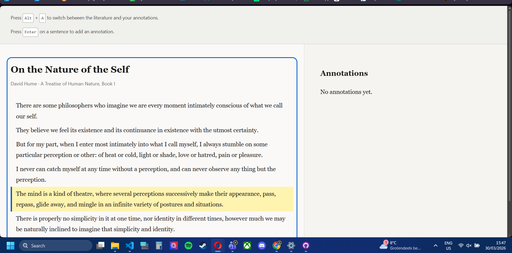
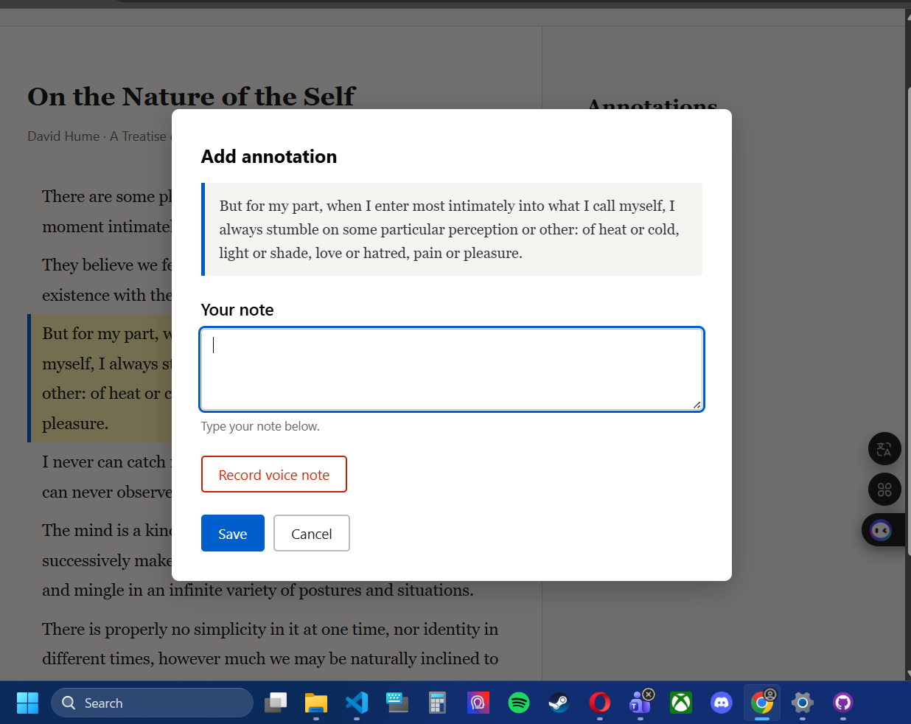
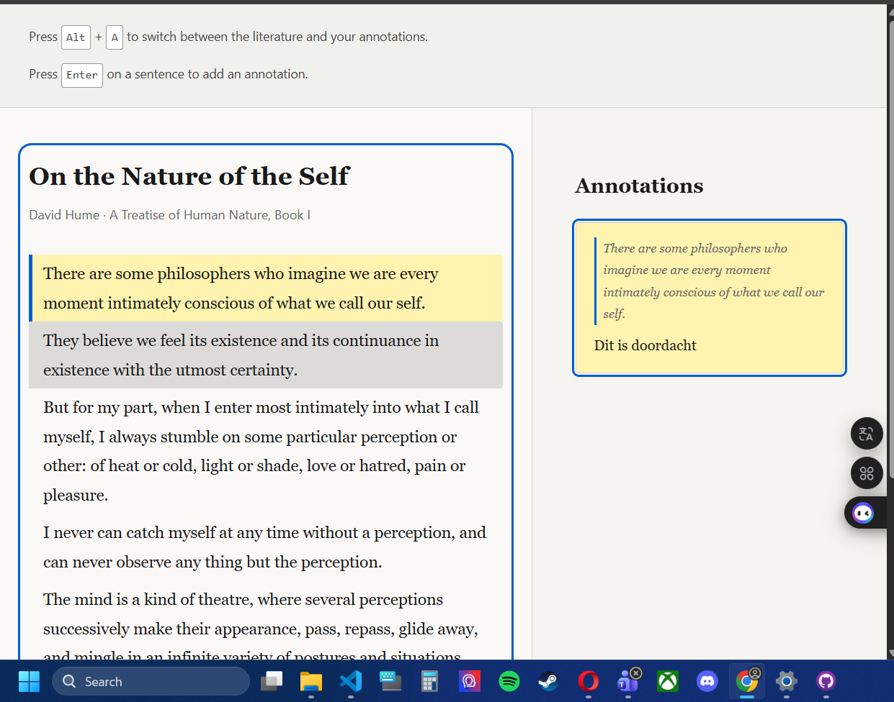

# Human Centered Design — Accessible Annotation Tool

Dit project draait om de ontwikkeling van een toegankelijke annotatietool, specifiek ontworpen vanuit de principes van Human Centered Design voor Roger. Roger is een filosoof met maculadegeneratie die volledig afhankelijk is van een screenreader. Zijn wens is filosofische teksten lezen en per zin aantekeningen kunnen maken in de vorm van tekst of spraakopnames.

## Maandag 30/03

Vandaag heb ik het fundement van deze tool neergezet. Aangezien ik Roger nog niet heb ontmoet, heb ik nog niet zijn persoonlijke functies of wensen kunnen toevoegen. Maar ik heb met een aantal aannames wel wat navigatie shortcuts geimplementeerd en design keuzes gemaakt.

Om de leeservaring voor Roger zo rustig mogelijk te houden, is de tekst opgedeeld in losse zinnen, elk verpakt in een eigen 
-element. De volledige applicatie is voorzien van de role="application". Dit is een bewuste technische keuze: hierdoor vangen we de pijltjestoetsen direct op in de browser, in plaats van dat de schermlezer deze gebruikt voor zijn eigen navigatie commando's.

Met de pijltjestoetsen kan Roger nu door de zinnen bladeren. Zodra hij op een zin landt, wordt deze visueel gemarkeerd met een gele achtergrond en een blauwe rand aan de linkerkant. Voor de auditieve feedback gebruiken we een aria-live="polite" regio. Dit zorgt ervoor dat de schermlezer de zin direct voorleest zonder storende extra informatie zoals "1 van de 80", wat de concentratie op de filosofische inhoud zou ontnemen.

De eerste interface is opgebouwd uit twee kolommen: de tekst/literatuur aan de linkerkant en de annotaties aan de rechterkant. Het annotatiepaneel werkt volgens exact dezelfde logica als de tekstsectie. Met de pijltjestoetsen navigeer je tussen de verschillende 'kaarten' met aantekeningen, en met een druk op Enter open je een kaart om deze te bewerken. Beide panelen krijgen een duidelijke blauwe omlijning wanneer ze gefocust zijn, wat helpt bij de oriëntatie.

Het toevoegen van een annotatie is simpel gehouden. Wanneer Roger op een zin staat en op Enter drukt, opent er een dialoogvenster. 

Hier kan hij een tekstnotitie typen of een spraakbericht opnemen. Na het opslaan verschijnt de annotatie als een kaart in het rechterpaneel. Bestaande annotaties kunnen op dezelfde intuïtieve manier worden geopend en gewijzigd.

Om de efficiëntie te verhogen, hebben we een set vaste sneltoetsen geïmplementeerd:

- Pijltjestoetsen: Navigeren door zinnen of annotatiekaarten.

- Enter: Annotatie creeren op een geselecteerde zin;  of een annotatie kaart openen om te bewerken.

- Alt + A: Snel schakelen tussen de tekst en de annotaties.

